# 🐝 Bee Swarm RL System - Architecture Documentation

## System Overview

```mermaid
flowchart TB
    subgraph System["🐝 BEE SWARM MULTI-AGENT RL SYSTEM"]
        direction LR
        
        subgraph Training["📚 TRAINING LOOP<br/>train_orbital_v2.py"]
            T1[PPO Algorithm]
            T2[16 Parallel Envs]
            T3[Rollout Buffer]
        end
        
        subgraph Env["🌍 ENVIRONMENT<br/>BeeForagingEnv"]
            E1[Multi-Agent PG]
            E2[Orbital Mechanics]
            E3[Battery/Recharge]
            E4[Retasking]
        end
        
        subgraph Viz["📊 VISUALIZATION<br/>bee_orbits_3d.py"]
            V1[3D Orbital View]
            V2[Real-time HUD]
            V3[Event Logging]
            V4[Communication Viz]
        end
        
        Training <--> Env
        Env <--> Viz
    end
    
    style System fill:#1a1a2e,stroke:#00d4ff,color:#fff
    style Training fill:#2d2d44,stroke:#00ff88,color:#fff
    style Env fill:#2d2d44,stroke:#ffaa00,color:#fff
    style Viz fill:#2d2d44,stroke:#ff6b6b,color:#fff
```

---

## 1. Neural Network Architecture

### Actor Network (Per-Agent Policy)

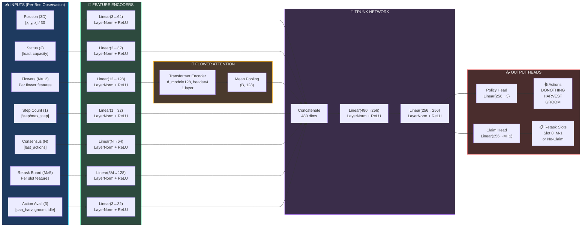

### Centralized Critic Network

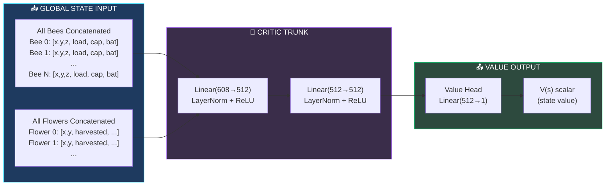

---

## 2. Per-Bee Retask Board & Communication

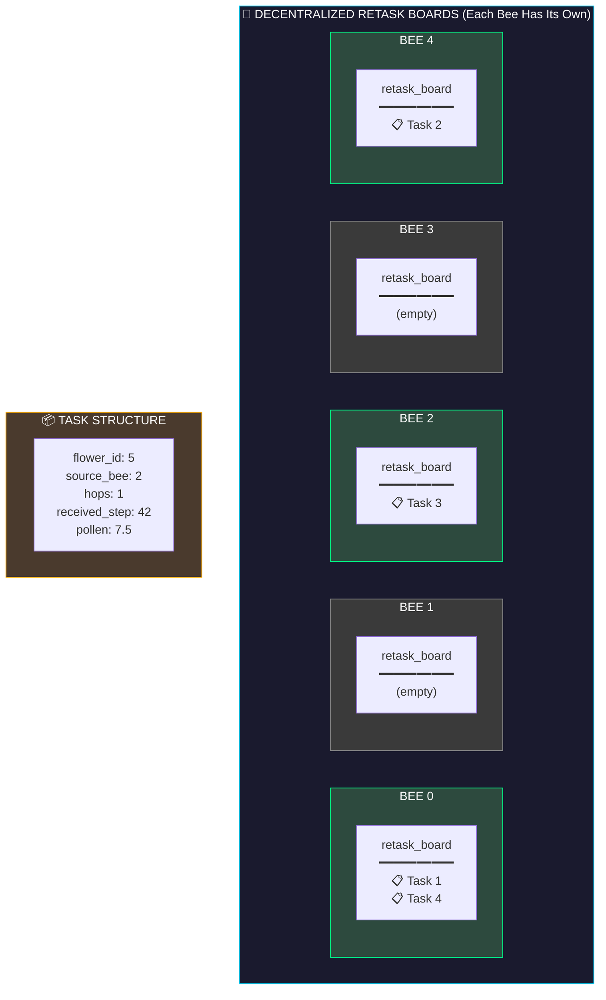

### Communication Flow (When Bee Dies)

```mermaid
sequenceDiagram
    participant B0 as 🐝 Bee 0<br/>(Battery = 0)
    participant SYS as 🌍 Environment
    participant B2 as 🐝 Bee 2<br/>(Nearest Active)
    
    Note over B0: 💀 BATTERY DEPLETED!<br/>Has flowers: [F5, F7, F9]
    
    B0->>SYS: I'm dying! Find nearest bee
    SYS->>SYS: Calculate 3D distances<br/>to all active bees
    SYS-->>B0: Nearest = Bee 2 (dist: 5.3)
    
    rect rgb(40, 60, 40)
        Note over B0,B2: 📡 BROADCAST TASKS
        B0->>B2: Task F5 {src:0, hops:1}
        B0->>B2: Task F7 {src:0, hops:1}
        B0->>B2: Task F9 {src:0, hops:1}
    end
    
    Note over B0: assigned = []<br/>(cleared)
    Note over B2: retask_board now has<br/>3 new tasks!
```

### Task Propagation Logic (Each Step)

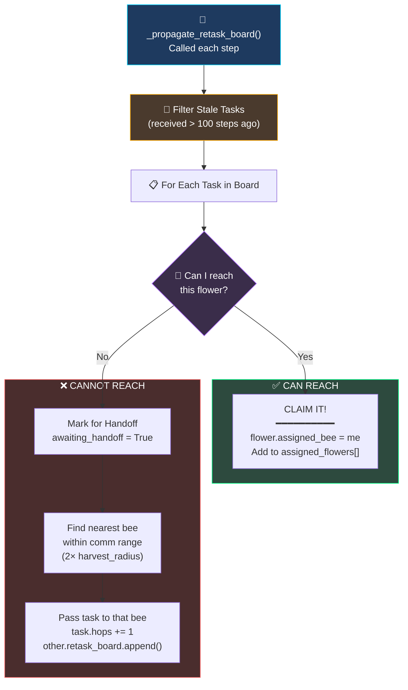

---

## 3. Environment Architecture

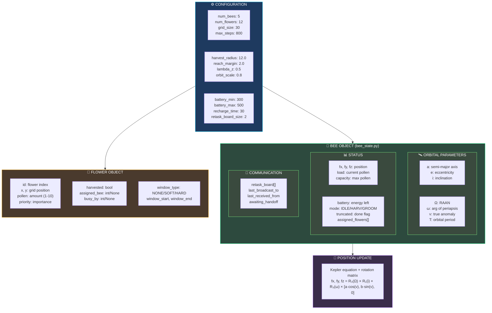

### Action & Observation Space

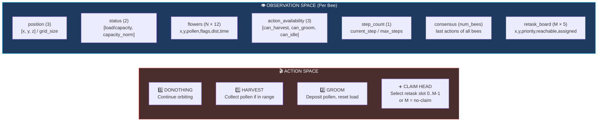

---

## 4. Training Loop (PPO)

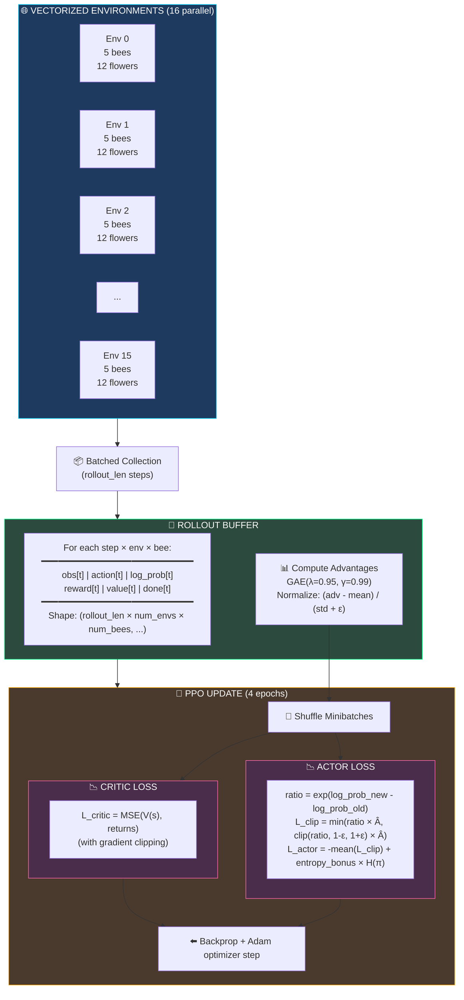

---

## 5. Reward Structure

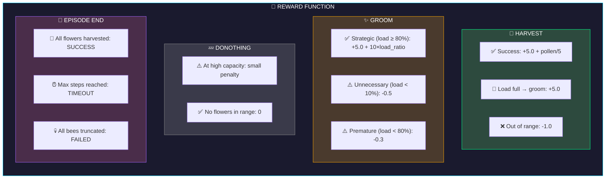

---

## 6. Visualization Pipeline

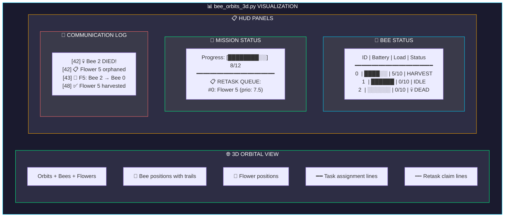

---

## 7. Key Files Reference

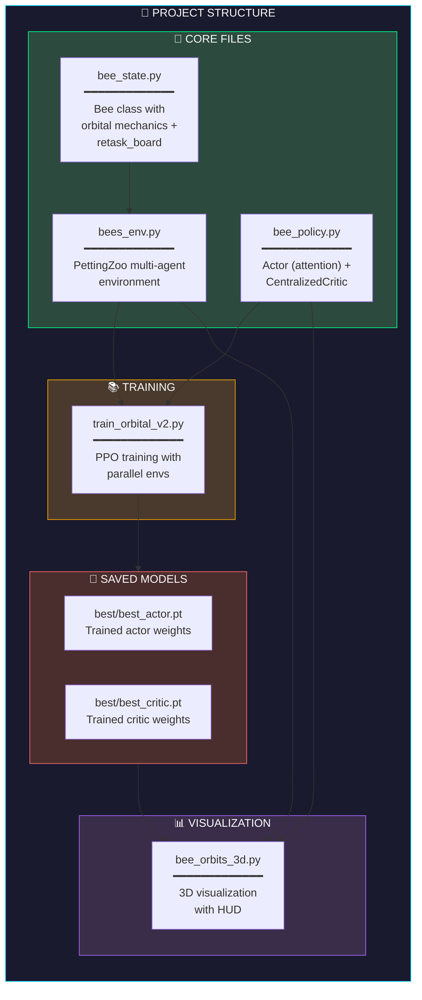

---

## 8. Hyperparameters

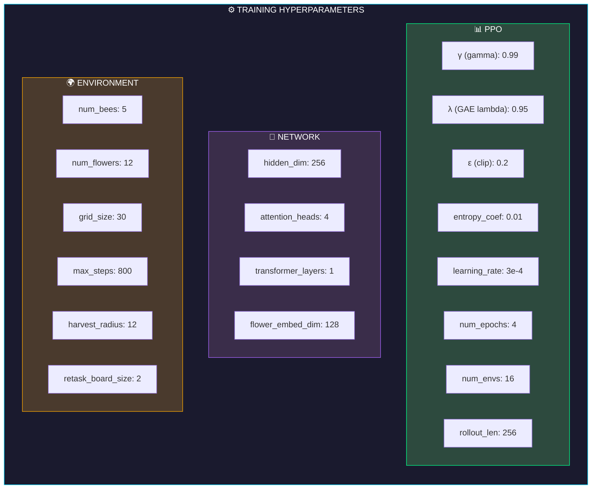

---

## 9. Full System Data Flow

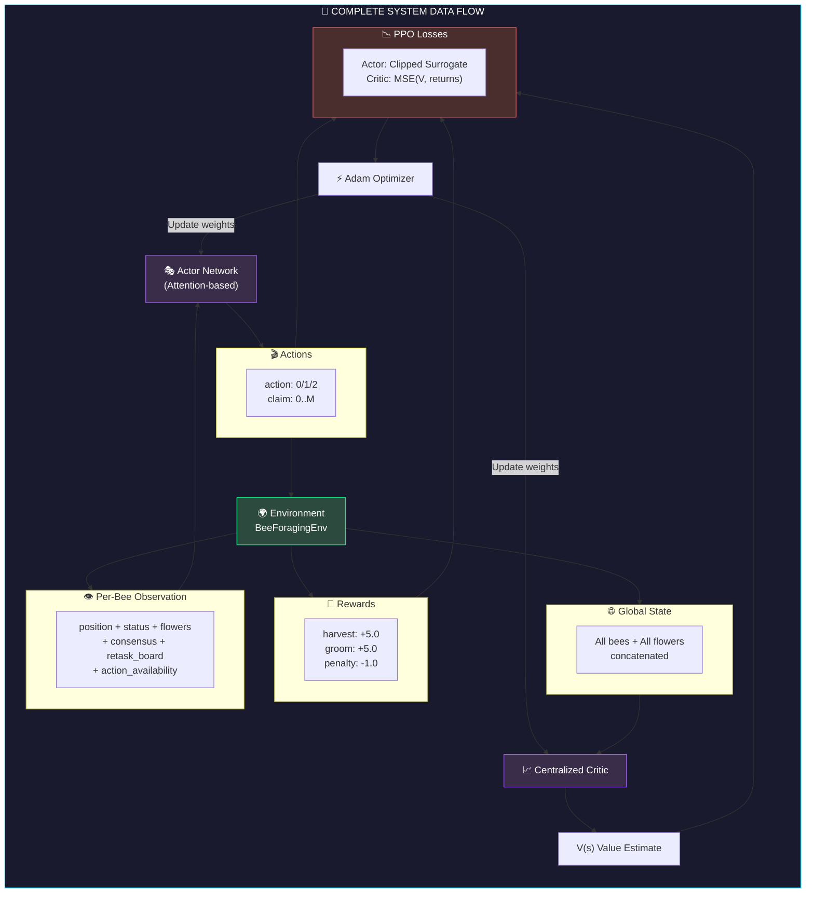
